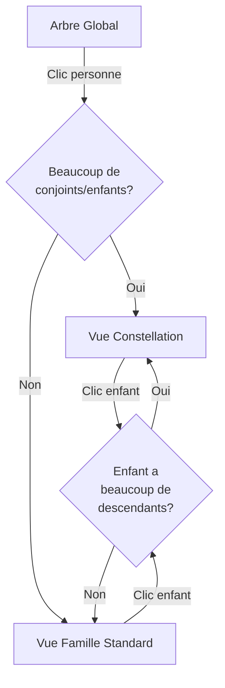

# 🌟 Vue Constellation - Affichage Dynamique pour Familles Complexes

## 🎯 Objectif

Créer un affichage **libre et dynamique** pour les personnes ayant eu plusieurs mariages, divorces, et beaucoup d'enfants. Au lieu d'un affichage hiérarchique rigide, la vue constellation dispose les membres de la famille de manière **organique** en cercles.

## 👥 Cas d'Usage

### Personnes Concernées

1. **Amadou Bamba Diop (Badara)**
   - 4 conjointes différentes
   - 21 enfants
   - Plusieurs mariages et divorces

2. **Amadou Diop (Doudou)**
   - 4 conjointes différentes
   - 9 enfants
   - Parcours matrimonial complexe

## 🎨 Design de la Vue Constellation

### Disposition Spatiale

```
              Enfant1  Enfant2
                 \      /
                Conjoint1
                    |
    Enfant5 --  Conjoint2 -- PERSONNE -- Conjoint3 -- Enfant3
                    |                         |
                 Enfant6                   Enfant4
```

### Caractéristiques

1. **Personne Centrale** (Grande carte au centre)
   - Taille : 128×128px
   - Position : Centre exact de l'écran
   - Toujours visible

2. **Conjoints en Cercle** (Cartes moyennes)
   - Taille : 96×96px
   - Disposés en cercle autour de la personne (rayon 200px)
   - Angle calculé automatiquement selon le nombre

3. **Enfants Autour des Mères** (Petites cartes)
   - Taille : 80×80px
   - Groupés autour de leur mère respective
   - Rayon : 120px depuis la mère
   - Cliquables si ont des enfants

### Algorithme de Positionnement

```typescript
// Position centrale
centerX = width / 2
centerY = height / 2

// Conjoints en cercle
for each spouse (index i):
  angle = (i / totalSpouses) * 2π - π/2
  x = centerX + cos(angle) * 200
  y = centerY + sin(angle) * 200

// Enfants autour de chaque conjoint
for each child of spouse:
  baseAngle = spouse angle
  angleOffset = (childIndex - (totalChildren-1)/2) * 0.5
  finalAngle = baseAngle + angleOffset
  x = spouseX + cos(finalAngle) * 120
  y = spouseY + sin(finalAngle) * 120
```

## 🔧 Implémentation Technique

### Nouveau Composant : `ConstellationFamilyView.tsx`

**Emplacement** : `src/pages/ConstellationFamilyView.tsx`

**Fonctionnalités** :
- ✅ Affichage en constellation
- ✅ Groupement enfants par mère
- ✅ Navigation vers enfants (clic)
- ✅ Responsive (adapte aux tailles d'écran)
- ✅ Lignes de liaison entre membres
- ✅ Hover effects et animations

### Route Ajoutée

```typescript
<Route path="/constellation/:personName" element={<ConstellationFamilyView />} />
```

**URL Exemple** :
```
http://localhost:8080/constellation/Amadou%20Bamba%20Diop%20(Badara)
```

### Redirection Automatique

Dans `PersonInfoPanel.tsx`, le système détecte automatiquement si une personne a besoin de la vue constellation :

```typescript
if (person.spouses.length > 2 || person.enfants.length > 8) {
  navigate(`/constellation/${encodeURIComponent(person.name)}`);
} else {
  navigate(`/family/${encodeURIComponent(person.name)}`);
}
```

**Critères** :
- Plus de 2 conjoints → Vue constellation
- Plus de 8 enfants → Vue constellation
- Sinon → Vue famille standard

## 📊 Comparaison des Vues

| Critère | Vue Standard | Vue Constellation |
|---------|--------------|-------------------|
| **Conjoints** | ≤ 2 | > 2 |
| **Enfants** | ≤ 8 | > 8 |
| **Layout** | Hiérarchique vertical | Organique en cercles |
| **Espacement** | Fixe et aligné | Dynamique et libre |
| **Groupement** | Par génération | Par mère |
| **Navigation** | Linéaire | Constellation |

## 🎨 Éléments Visuels

### Cartes Personnalisées

```typescript
interface PersonCardProps {
  person: PersonNode;
  type: "central" | "spouse" | "child";
  onClick?: () => void;
  style?: React.CSSProperties; // Position absolue
}
```

**Tailles** :
- `central` : 128×128px (w-32 h-32)
- `spouse` : 96×96px (w-24 h-24)
- `child` : 80×80px (w-20 h-20)

**Couleurs** :
- Homme : `bg-gradient-to-br from-blue-500 to-blue-700`
- Femme : `bg-gradient-to-br from-pink-500 to-rose-600`

### Lignes de Liaison

```typescript
<svg className="absolute inset-0 pointer-events-none">
  <line
    x1={centerX} y1={centerY}
    x2={spouseX} y2={spouseY}
    stroke="hsl(var(--primary))"
    strokeWidth="2"
    strokeDasharray="5,5"
    opacity="0.3"
  />
</svg>
```

Lignes en pointillés entre personne centrale et conjoints.

### Interactions

1. **Hover sur carte** : Scale 110% + shadow-2xl
2. **Clic sur enfant** : Navigation vers sa famille
   - Si enfant a beaucoup de descendants → Vue constellation
   - Sinon → Vue famille standard
3. **Badge "X enfants"** : Affiché si l'enfant a des descendants

## 📱 Responsive

### Calcul Dynamique des Positions

```typescript
const containerWidth = window.innerWidth;
const containerHeight = window.innerHeight;
```

Les positions sont recalculées en fonction de la taille de l'écran.

### Breakpoints

- **Mobile (< 640px)** : Rayon réduit, cartes plus petites
- **Tablet (640-1024px)** : Rayon moyen
- **Desktop (> 1024px)** : Rayon complet

## 🚀 Comment Accéder

### 1. Depuis l'Arbre Global

Cliquer sur une personne avec beaucoup de conjoints/enfants → Le bouton "Voir la famille" redirige automatiquement vers la vue constellation.

### 2. Depuis une Vue Famille

Si un enfant a beaucoup de descendants, cliquer dessus → Redirection vers sa constellation.

### 3. URL Directe

```
/constellation/Amadou%20Bamba%20Diop%20(Badara)
/constellation/Amadou%20Diop%20(Doudou)
```

## ✨ Avantages

1. **Clarté Visuelle** - Pas de chevauchement ni de débordement
2. **Groupement Logique** - Enfants regroupés par mère
3. **Navigation Intuitive** - Clic pour explorer
4. **Dynamique** - Positions calculées automatiquement
5. **Esthétique** - Disposition harmonieuse en cercles
6. **Performance** - Léger et fluide

## 🔄 Navigation entre Vues



## 📝 Structure des Données

### Groupement par Mère

```typescript
const spousesWithChildren = new Map<string, string[]>();

person.spouses.forEach(spouseName => {
  const commonChildren = person.enfants.filter(childName => {
    const child = engine.getPerson(childName);
    return child && child.parents.includes(spouseName);
  });
  spousesWithChildren.set(spouseName, commonChildren);
});
```

Chaque conjoint est associé à ses enfants biologiques uniquement.

## 🎯 Résumé

La **Vue Constellation** offre une solution élégante et moderne pour visualiser les familles complexes avec plusieurs mariages et nombreux enfants. L'affichage **libre et dynamique** permet une meilleure compréhension des relations familiales sans surcharge visuelle.

---

**Personnes utilisant cette vue** :
- Amadou Bamba Diop (Badara) : 4 conjointes, 21 enfants
- Amadou Diop (Doudou) : 4 conjointes, 9 enfants
- Toute personne avec > 2 conjoints ou > 8 enfants

**Prochaines améliorations possibles** :
- Zoom/pan interactif
- Mode "Focus sur un conjoint"
- Affichage des petits-enfants en option
- Export de la constellation en image
